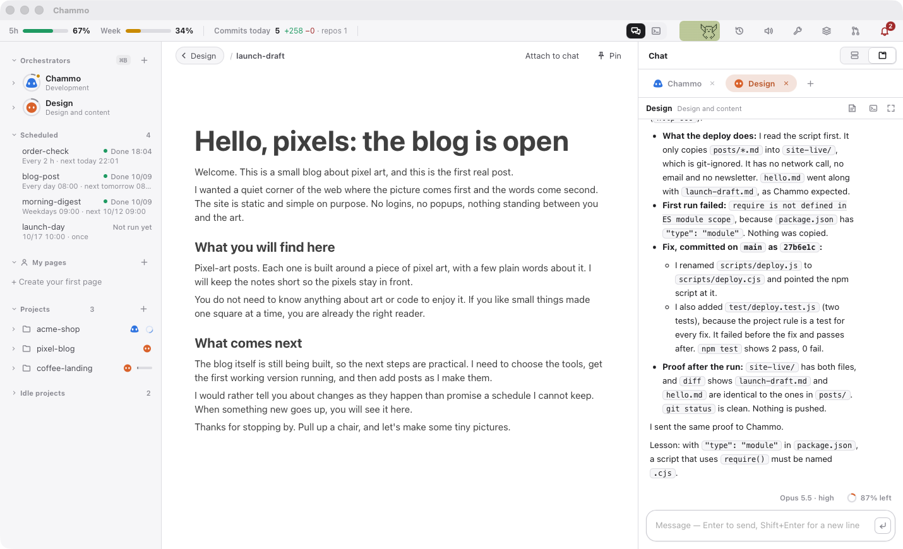
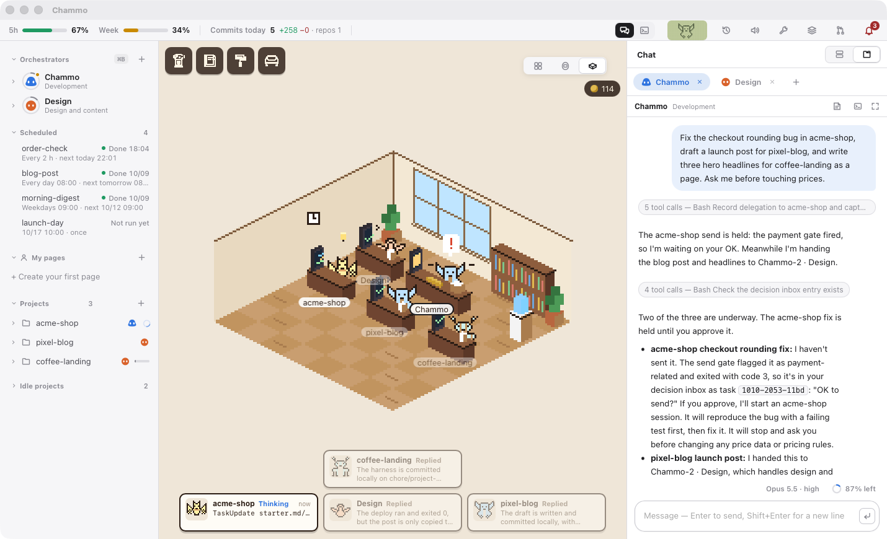
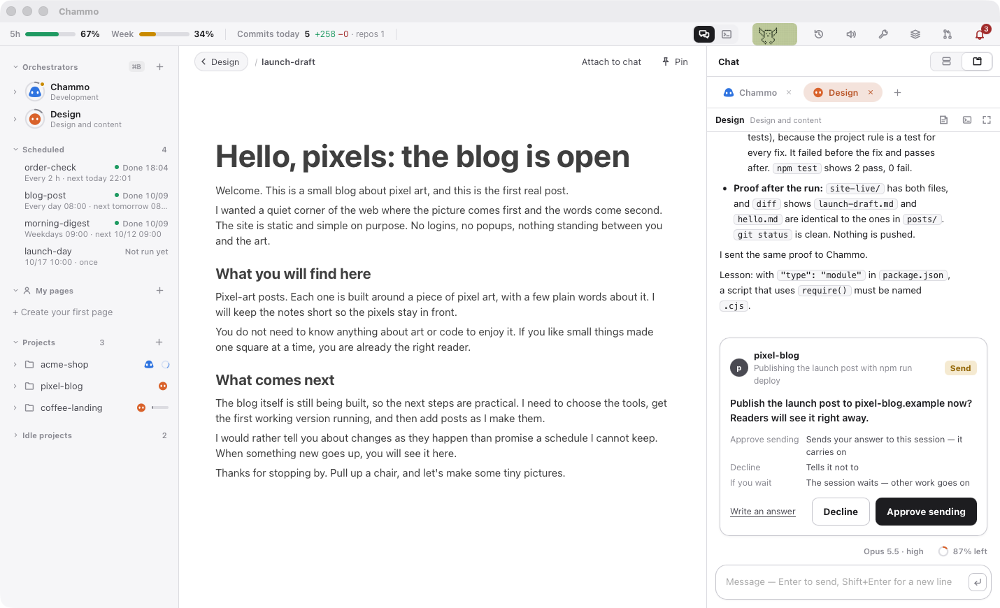
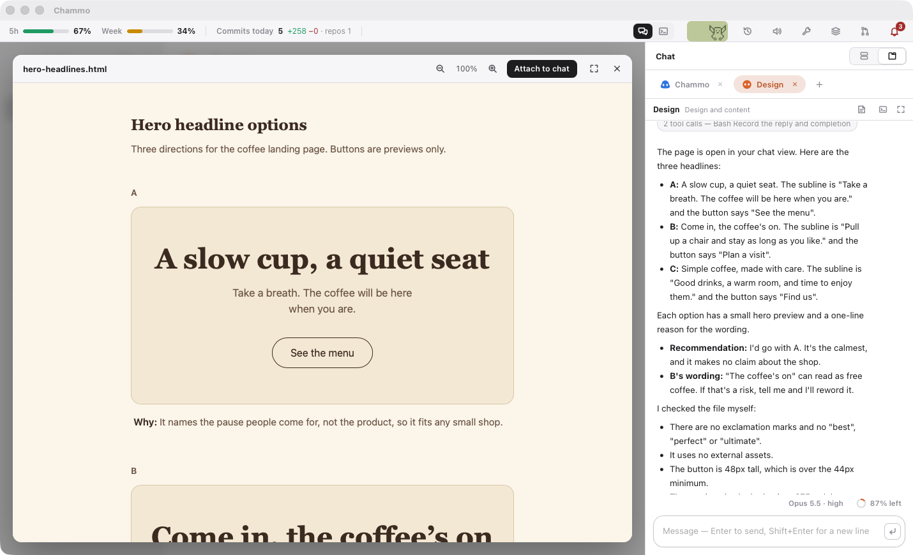
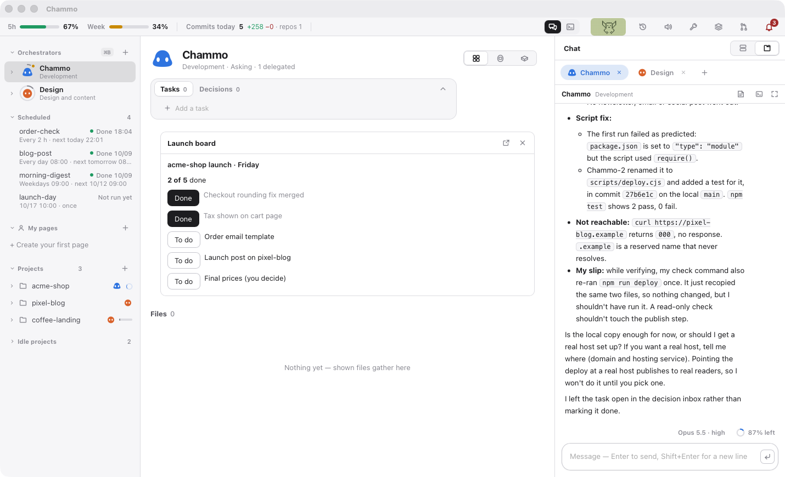
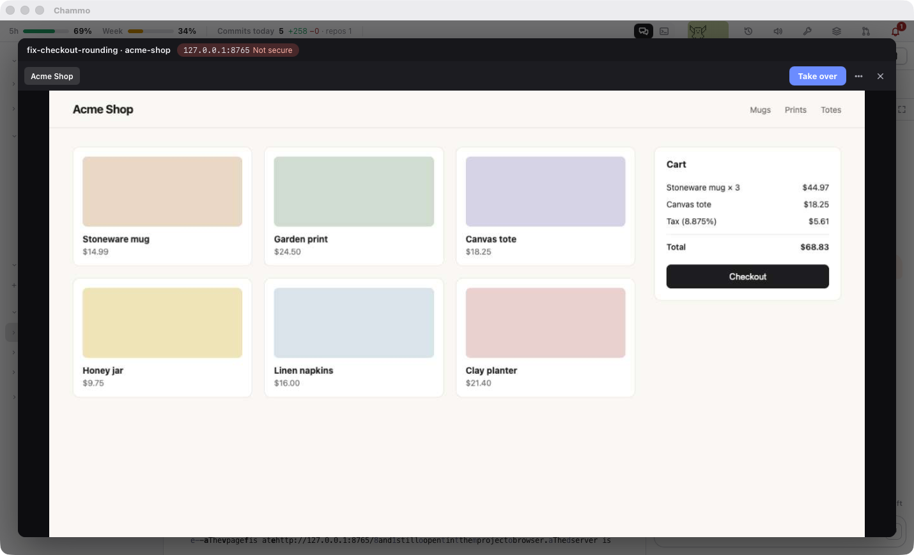
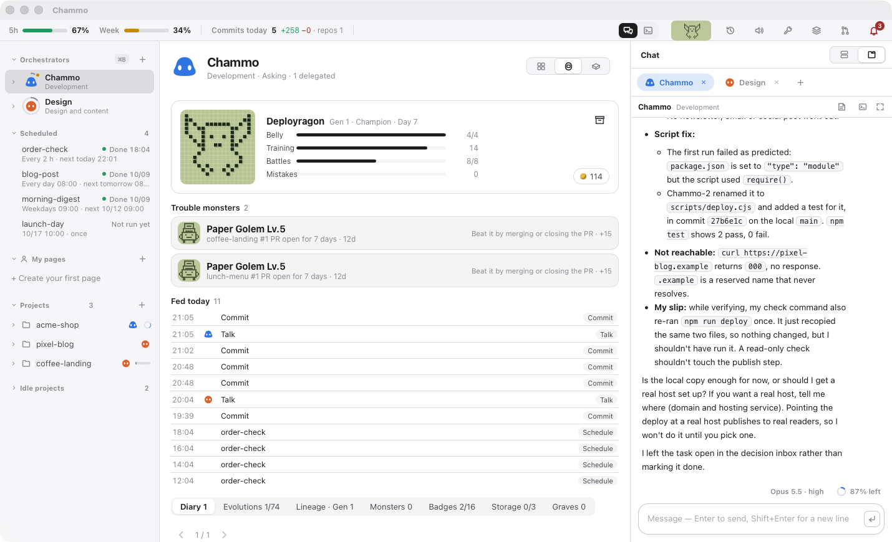

# Chammo (참모)

**Claude Code 를 위한 AI 참모. 결정은 당신이, 팀 운영은 참모가.**

[English](README.md)



Chammo 는 혼자서 여러 프로젝트를 동시에 굴리는 사람을 위한 데스크톱 앱입니다(macOS, Windows 는 미리보기판). 당신은 Claude Code 세션 하나 — 참모 — 하고만 채팅합니다. 참모는 프로젝트마다 백그라운드 Claude Code 세션을 띄워 일을 나눠 주고, 결과를 읽고, 머지해도 되는 건 머지하고, 되돌릴 수 없는 결정만 당신에게 가져옵니다. 모든 세션은 진짜 대화형 Claude Code 라서 언제든 열어서 직접 입력할 수 있습니다.


## 무엇을 할 수 있나

### 한 번 말하면 팀이 움직인다

참모에게 원하는 걸 글이나 말로 전합니다. 참모가 요청을 프로젝트별로 나누고, 도는 세션이 없으면 띄우고, 일이 돌아오면 한두 줄로 알려 줍니다. 참모마다 브라우저처럼 탭이 하나씩 있고, 끌어서 순서를 바꿉니다. 사이드바에선 세션 사진이 상태를 보여 줍니다 — 고리는 대화가 얼마나 찼는지, 점은 일하는 중인지 질문을 기다리는지.



### 내 결정만 내린다

돈이 움직이는 일(결제·환불·과금)은 보내기 전부터 당신을 기다립니다. 세션은 운영에 손대기 직전 — 운영 DB 마이그, 운영 데이터 삭제, 운영 배포, 실사용자 발송 — 에 멈추고 카드로 묻습니다. PR 은 CI 가 초록이면 참모가 머지하고, DB·돈·보안을 바꾸는 것만 당신을 기다립니다. 답은 채팅 속 카드, 종, 폰 어디서든.



### 채팅 옆에서 읽고 검토한다

세션이 보여 주는 문서는 채팅 옆에 뜹니다. 마크다운은 고칠 수 있는 노션식 문서로(블록 끌기, `/` 로 넣기, 밖에서 고친 내용은 덮지 않고 합침), HTML 시안 검토·PDF·그림·영상도 같이. 참모와 프로젝트마다 지금 하는 일을 모은 대시보드가 있습니다.



### 내 화면을 만든다 — 참모 모드(미리보기)

모드는 화면이 달린 Claude Code 플러그인입니다 — 출시 체크리스트, 주문 현황판, 예약을 돌리는 버튼 같은 것. Chammo 가 진짜 패널로 그려 줍니다 — 따로 창, 옆 칸, 대시보드 칸, 팝업, 꽉 채우기. 참모에게 부탁하면(**모드 > 새 모드 만들기…**) 프로젝트로 만들어 줍니다. Claude Code 2.1.287 이상이 필요합니다.



### 지켜볼 수 있는 브라우저를 세션에 준다

설정의 **설치** 버튼 하나로 프로젝트마다 로그인이 유지되는 브라우저 프로필이 생깁니다. 앱 안에서 실시간으로 보거나 크롬에서 열고, 세션이 당신을 부르면(로그인·캡차) 브라우저 창에서 바로 답합니다.



### 정해진 때 돌린다

"매일 아침 블로그 올리기", "2시간마다 주문 확인", 또는 정한 날짜·시각에 한 번. 앱이 꺼져 있어도 macOS(Windows 는 작업 스케줄러)가 예약을 깨우고, 매번 진짜 Claude Code 세션이 일하고 보고합니다. 시작하다 실패하면 15분 뒤 한 번 다시 돌리고, 멈춘 예약은 참모에게 알립니다.


### 사무실을 둔다

세션마다 책상에 앉은 픽셀 캐릭터가 있습니다 — 고칠 땐 타자를 치고, 읽을 땐 서류를 읽고, 명령을 돌릴 땐 진행 막대를 봅니다. 펫은 커밋·PR·CI 로 자라고 다음 세대에 버릇을 물려주며, CI 연속 빨강이나 멈춘 세션은 물리칠 몬스터로 나타납니다. 머지로 번 코인은 가구·책상 소품·조명·칭호·모자가 나오는 뽑기 기계에 씁니다. 노는 기능은 하나씩 끌 수 있습니다.



### 그 밖에

- **음성** — 답을 읽어 줍니다(맥 음성, 또는 맥 안에서 도는 자연스러운 Supertonic). 말하는 탭이 빛납니다. 말하기 키(지구본 또는 오른쪽 ⌥)를 누르고 말하면 받아 적습니다.
- **폰**(선택, Tailscale) — QR 로 짝을 지으면 홈 화면 웹앱에서 채팅하고 결정에 답하고 알림을 받습니다.
- **Claude 계정 여러 개** — 로그인을 여럿 두면 지금 계정이 한도에 가까워질 때 다음 계정으로 넘깁니다.
- **하네스가 있는 프로젝트** — 새 일은 `CLAUDE.md`·`docs/starter.md`·`docs/roadmap.md` 가 깔린 프로젝트 폴더로 시작하고, 세션은 그걸 먼저 읽고 끝날 때 고칩니다.
- **교훈** — 세션이 답 끝에 남긴 `교훈:` 줄이 그 프로젝트의 다음 지시에 따라붙습니다.
- **도구** — MCP 서버·플러그인·스킬을 프로젝트별이나 전체로 켜고 끄고(렌치), 하네스가 얼마나 무거운지 봅니다(하니터).
- **한국어·영어** — 앱 전체.

## 필요한 것

- Apple 실리콘(M1 이상) 맥, macOS 14 이상 — 또는 Windows 10/11 x64 PC(미리보기판)
- 인터넷 연결과 Claude 계정(Pro, Max 등)

나머지 — Xcode 명령줄 도구, Claude Code, 로그인, GitHub CLI(선택) — 는 처음 켤 때 확인하고 버튼 하나로 깔아 줍니다.

## 설치

**DMG 로** — [Releases](https://github.com/honorstudio/chammo/releases)에서 `Chammo_x.y.z_aarch64.dmg` 를 받아 `Chammo` 를 `응용 프로그램` 폴더로 끌어다 놓고 켭니다. 릴리스 DMG 는 Apple 공증을 받았습니다.

**터미널 한 줄로** — 최신 DMG 를 받아 `/Applications` 에 넣고 켜 줍니다.

```sh
curl -fsSL https://raw.githubusercontent.com/honorstudio/chammo/main/scripts/install.sh | bash
```

**Windows(미리보기판)** — [Releases](https://github.com/honorstudio/chammo/releases)의 `Chammo_x.y.z_x64-setup.exe` 를 실행합니다. 내 사용자에게만 깔리고 WebView2 가 없으면 받아 옵니다. 설치 파일에 아직 코드 서명이 없어 SmartScreen 이 막을 수 있습니다 — **추가 정보 > 실행**. 참모의 도우미 스크립트는 **Python 3** 이 필요합니다(`winget install Python.Python.3.12`). 단축키는 ⌘ 대신 Ctrl 입니다(글자는 Ctrl+Shift, 숫자·기호는 Ctrl 하나).

**소스에서** — Rust(stable), Node.js 22 이상, pnpm, Xcode 명령줄 도구가 필요합니다.

```sh
git clone https://github.com/honorstudio/chammo.git
cd chammo/app
pnpm install
pnpm tauri build
```

앱은 `app/src-tauri/target.noindex/release/bundle/macos/Chammo.app` 에 생깁니다. 직접 빌드한 앱은 공증이 없어서 처음 켤 때 **시스템 설정 > 개인정보 보호 및 보안**의 **그래도 열기**를 누르거나 `xattr -dr com.apple.quarantine /Applications/Chammo.app` 을 한 번 실행하세요.

## 처음 켤 때

다섯 단계 설정이 열립니다: 언어 → 이 맥 점검(빠진 것 설치) → 참모 이름, **프로젝트 폴더**(안의 폴더 하나가 프로젝트 하나), **HQ 폴더**(참모가 도는 곳) → 켤 기능 → 준비 끝. Chammo 는 따로 로그인하지 않고 맥에 로그인된 `claude` 를 그대로 씁니다. 설정은 **Chammo > 설정…**(⌘,).

## 단축키

| 키 | 하는 일 |
|---|---|
| ⌘1 ~ ⌘9 | 채팅 탭 옮기기 |
| ⌃⇧PageUp / PageDown | 지금 탭을 왼쪽 / 오른쪽으로 |
| ⌘Enter | 하던 일 멈추고 바로 보내기 |
| ⌘T · ⌘W | 새 세션 · 보고 있는 세션 끄기(대화는 남음) |
| ⌘K · ⌘B · ⌘J | 프로젝트 검색 · 사이드바 · 작업 패널 |
| ⌘F | 문서 찾기 |
| ⌘, | 설정 |

## 동작 방식

```
 나 ──채팅 / 음성──▶  참모 (HQ 폴더의 살아 있는 Claude Code 세션)
                              │  scripts/task send · SendMessage
          ┌───────────────────┼───────────────────┐
          ▼                   ▼                   ▼
     acme-shop           pixel-blog        coffee-landing     ← claude --bg, 프로젝트마다 하나
          │                   │                   │
          └──── PR ──▶ 리뷰 관문 (review.json) ──▶ 머지, 또는 나에게 질문
```

- **세션**은 Claude Code 내장 백그라운드 세션입니다. 상태는 `claude agents --json` 으로 읽고, 채팅은 세션 대화 기록으로 그리고, 전체 터미널은 `claude attach <id>` 로 엽니다.
- **위임**은 `scripts/task` 로 `tasks.jsonl` 에 적습니다. 작업 패널이 그 파일을 읽고, `scripts/task ask` 는 결정 대기함에 질문을 올립니다.
- **관문**은 PR 의 파일·제목·본문으로 계산하고(AI 호출 없음) `review.json` 에 적습니다. 참모는 머지하기 전에 이 파일을 봅니다.

자세한 구조: [docs/ARCHITECTURE.md](docs/ARCHITECTURE.md)

## 설정

모든 파일은 데이터 폴더에 있습니다: `$CHAMMO_HOME`, 없으면 `~/.chammo`. `config.json` 은 설정 화면이 고치지만 직접 편집해도 됩니다.

| 항목 | 뜻 | 기본값 |
|---|---|---|
| `language` | `"ko"` 또는 `"en"` | 시스템 언어 |
| `assistantName` | 참모 이름 | `참모` / `Chammo` |
| `devRoot` | 프로젝트 폴더 | `~/Developer`·`~/Projects` 중 있는 것 — 첫 설정에서 고르거나 만듭니다 |
| `hqDir` | 참모 세션 폴더 | `<데이터>/hq` |
| `githubUser` | 리뷰·CI 에 쓰는 계정 | `gh api user` 에서 |
| `ttsCommand` | 한 줄을 읽어 주는 명령 | macOS `say` |
| `features` | `office`, `tama`, `gacha`, `review`, `voice`, `agentView`(세션 브라우저를 앱에서 보기), `autoRevive`(꺼진 세션을 알아서 다시 켜기), `computerUse`(세션이 화면을 조종) | `autoRevive`·`computerUse` 빼고 켜짐 |

## 개인정보

Chammo 는 내 컴퓨터 안에서만 돕니다. 서버도 계정도 사용 통계도 없습니다. 모델 통신은 전부 Claude Code 의 것, GitHub 통신은 전부 `gh` 의 것이고 내 로그인을 씁니다. Chammo 자체가 인터넷에 나가는 건 이것뿐입니다:

- **버전 확인** — npm 레지스트리에서 최신 Claude Code 버전, GitHub 에서 최신 Chammo 릴리스. 나에 대한 정보는 보내지 않습니다.
- **브라우저 설치**(설치를 누를 때) — Node.js·Chrome Beta·브라우저 도구를 공식 출처에서 받고, 체크섬이나 구글 서명이 맞을 때만 씁니다.
- **계정 사용량**(계정을 저장했을 때만) — 각 계정의 5시간·주간 사용량을 그 계정 토큰으로 api.anthropic.com 에 묻습니다. Claude Code `/usage` 와 같은 요청입니다.
- **폰 알림**(폰을 짝지었을 때만) — 제목과 한 줄이 종단 암호화되어 폰의 푸시 서비스를 거칩니다.
- **텔레그램**(내 봇을 연결했을 때만) — 봇에게 보낸 말, 참모 답(키·비밀번호는 가림), 결정 카드가 api.telegram.org 를 거칩니다. 결제·발송·삭제·운영 단계는 거기선 알림만 가고 답은 앱에서 합니다.
- **하니터 글꼴** — 하니터를 열면 Google Fonts 에서 글꼴을 불러옵니다.
- **내가 누르는 설치** — 설정의 설치 버튼과 Supertonic **받기**는 공식 출처에서 받습니다.

## 현재 상태와 한계

- **초기 단계입니다.** 한 사람이 매일 쓰던 도구를 그대로 공개했습니다.
- **Claude Code 의 문서화되지 않은 내부에 기댑니다** — 백그라운드 세션, `claude agents --json`, `claude attach`, 플러그인 화면 규약. Claude Code 2.1.280 이상의 2.1.x 에서 확인했습니다. 업데이트로 깨질 수 있고, 확인한 범위를 벗어나면 앱이 알려 줍니다.
- **백그라운드 세션은 `--dangerously-skip-permissions` 로 돕니다.** 묻지 않고 실행합니다. Chammo 의 관문(결제·운영 변경·머지 관문)이 그 앞에 서 있지만, 그래도 괜찮은 프로젝트와 기기에서만 쓰세요.
- **Windows 는 미리보기판입니다.** 아직 없는 것: 말하기 키, Supertonic, Office 파일 미리보기, 서명된 설치 파일.

## 기여

이슈와 PR 환영합니다. 개발 환경·테스트·몇 가지 규칙은 [CONTRIBUTING.md](CONTRIBUTING.md)를 보세요.

## 라이선스

[AGPL-3.0](LICENSE) © 2026 Honor Studio

제3자: 터미널 한글 글꼴 `app/public/fonts/ChammoHangul.woff2` 는 네이버 [D2Coding](https://github.com/naver/d2codingfont)을 한글만 남겨 고친 것으로, SIL Open Font License 1.1 에 따라 이름을 바꿨습니다 — [`app/public/fonts/OFL.txt`](app/public/fonts/OFL.txt) 참고. 선택 기능인 Supertonic 음성은 고를 때만 맥에 받습니다: `supertonic` 패키지(MIT)와 [OpenRAIL-M 라이선스](https://huggingface.co/Supertone/supertonic-3)의 Supertone 모델(사용 제한 있음). 라이브러리(Tauri, React, xterm.js, BlockNote, pdf.js, Playwright MCP 등)는 각자의 라이선스(MIT / Apache-2.0 / MPL-2.0)를 따릅니다.

Chammo 는 독립 프로젝트이며 Anthropic 과 제휴·보증·후원 관계가 없습니다. Claude 와 Claude Code 는 Anthropic 의 상표입니다.
