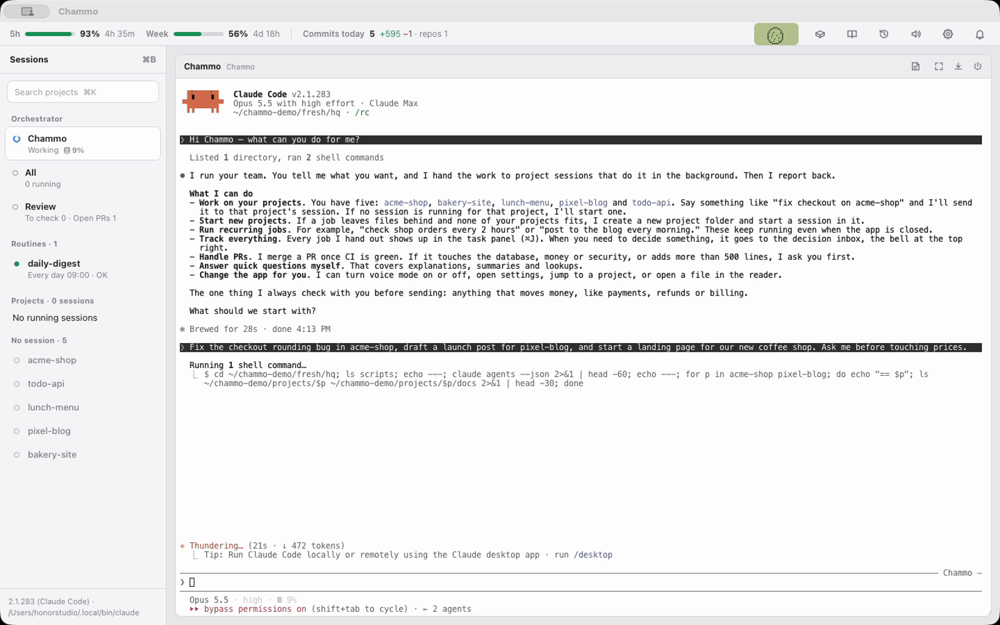
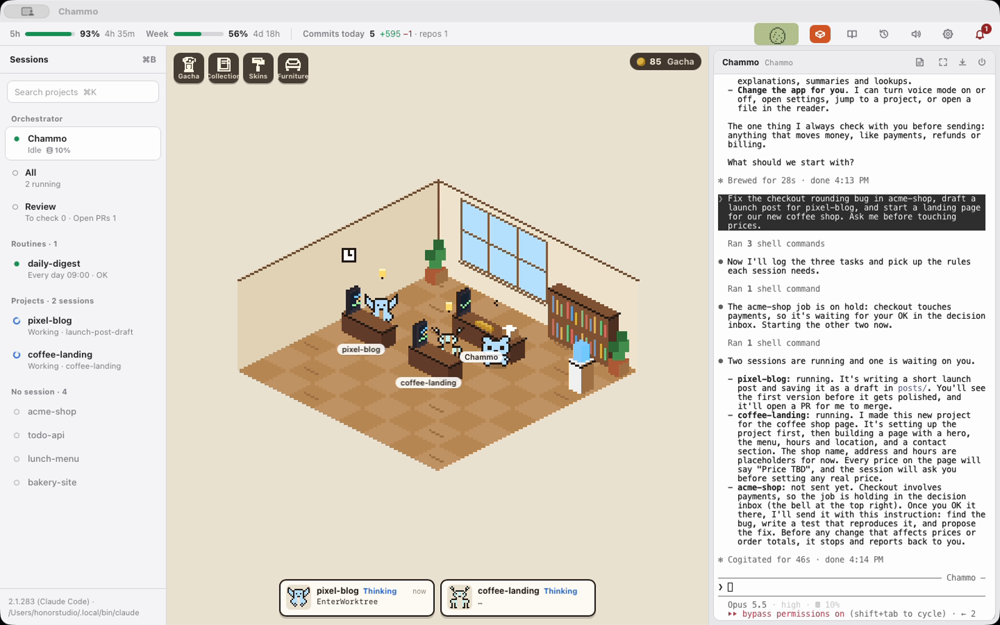
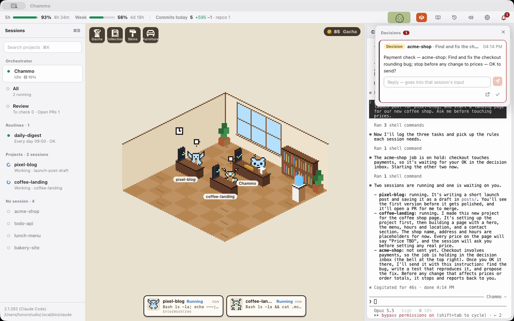
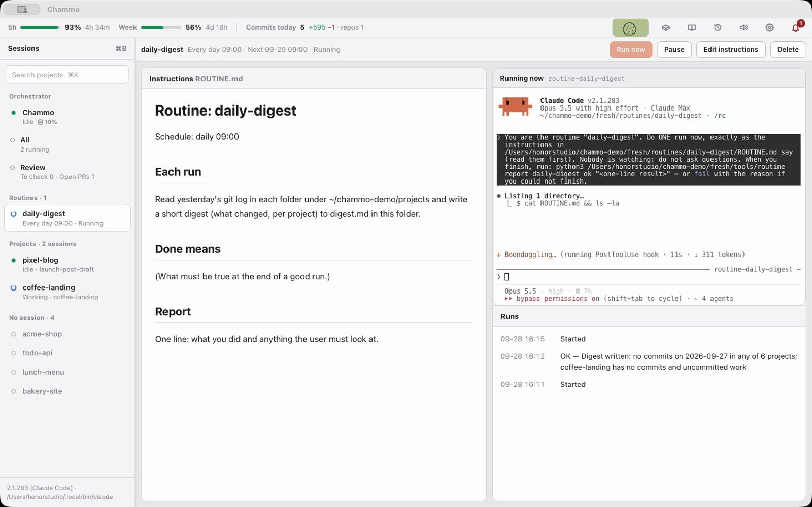
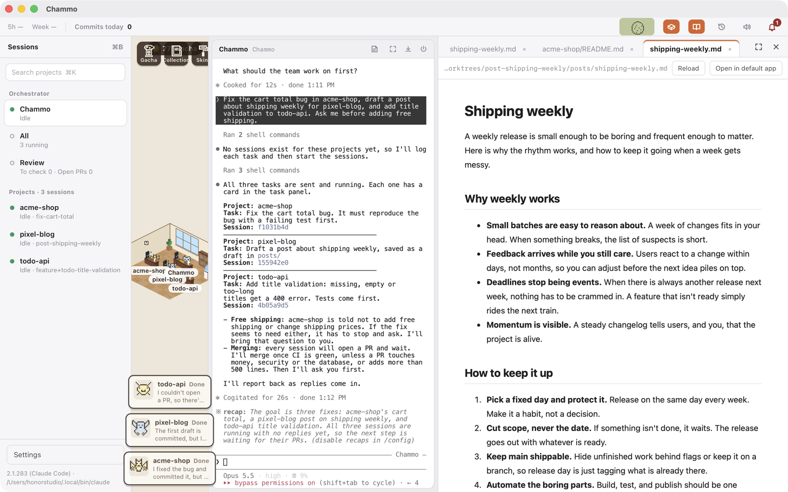
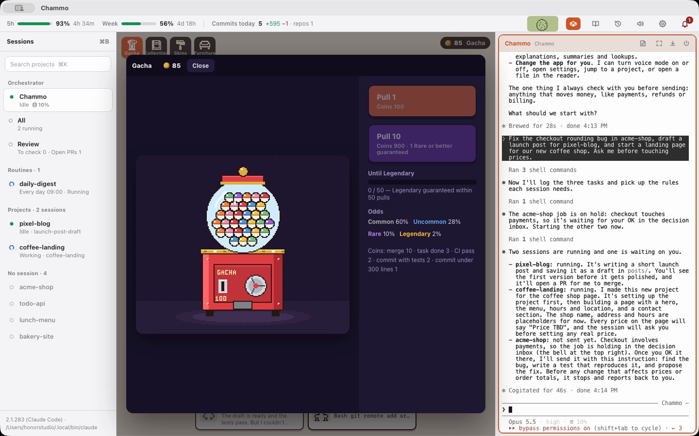
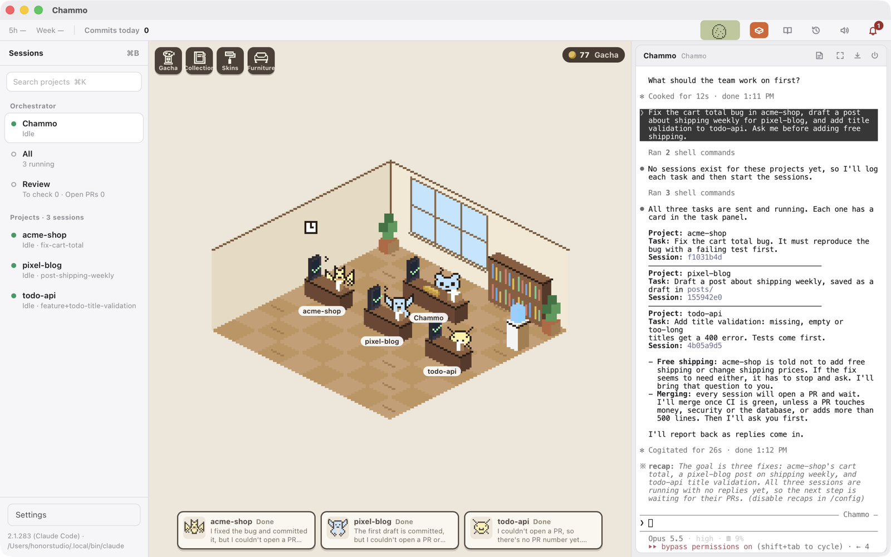
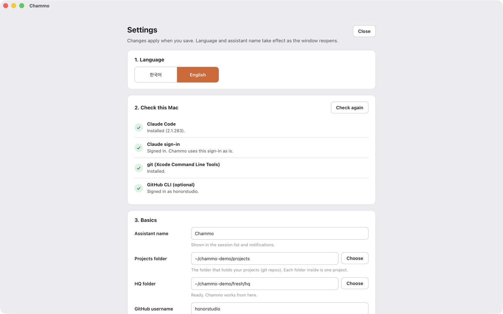

# Chammo (참모)

**Claude Code 를 위한 AI 참모. 결정은 당신이, 팀 운영은 참모가.**

[English](README.md)


Chammo 는 혼자서 여러 프로젝트를 동시에 굴리는 사람을 위한 macOS 앱입니다. 당신은 Claude Code 세션 하나 — 참모 — 하고만 이야기합니다. 참모는 프로젝트마다 백그라운드 Claude Code 세션을 띄워 일을 나눠 주고, 결과를 읽고, 머지해도 되는 건 머지하고, 되돌릴 수 없는 결정만 당신에게 가져옵니다. 모든 세션은 진짜 대화형 Claude Code 라서 언제든 열어서 직접 입력할 수 있고, 각 세션은 픽셀 사무실의 작은 캐릭터가 되어 지금 하는 일에 따라 타자를 치거나 서류를 읽거나 달립니다.

## 왜 만들었나

프로젝트가 다섯 개, 열 개가 되면 병목은 에이전트가 아니라 사람입니다. 터미널을 옮겨 다니고, 맥락을 다시 읽고, 굳이 내가 안 봐도 될 것까지 승인합니다. Chammo 는 이걸 뒤집습니다. 위임·후속 확인·일상적인 머지는 참모가 맡고, 당신 앞에는 정말 당신이 정해야 하는 것만 짧게 남습니다 — 결제, 운영 DB 변경, 돈이나 보안을 건드리는 PR 같은 것들입니다. 나머지는 멈추지 않고 흘러갑니다.

## 기능

- **참모 세션** — HQ 폴더에서 도는 살아 있는 Claude Code 세션 하나. 말로(또는 글로) 지시하면 위임하고, 챙기고, 한 줄로 보고합니다.
- **프로젝트마다 세션 하나** — 일회성 `claude -p` 가 아니라 Claude Code 내장 백그라운드 세션(`claude --bg`)입니다. `/clear`·`/compact` 같은 슬래시 명령이 그대로 되고, 어느 세션이든 직접 붙어서 이어받을 수 있습니다.
- **결정 대기함** — 참모가 당신에게 올린 것만 종 아래에 모입니다. 답장하면 물어본 세션 입력칸으로 바로 들어갑니다.
- **결제 관문** — 결제·환불·과금이 들어간 위임은 당신이 답할 때까지 보내지 않습니다.
- **리뷰·머지 관문** — 모든 프로젝트의 열린 PR 을 DB 마이그레이션·돈·보안·크기(500줄 이상) 기준으로 봅니다. 걸린 PR 은 세 줄 요약과 diff 를 들고 당신을 기다리고, 나머지는 CI 가 초록이면 참모가 머지합니다. '오늘 넣은 것'에서 되돌리기 PR 을 한 번에 만들 수 있습니다.
- **세션 되살리기** — Claude Code 관리 프로그램(daemon)이 다시 켜지면 어떤 세션이 꺼졌는지 알아채고 대화 그대로 다시 띄웁니다. 주인을 잃은 일도 따로 보여 줍니다.
- **권한 창** — 백그라운드 세션의 도구 권한 창은 화면을 읽어 *Allow* 를 이름으로 찾아 누릅니다(짐작으로 Enter 를 누르지 않습니다). 비밀번호·2FA·결제 창은 사람 몫으로 남깁니다.
- **음성** — 답을 원하는 TTS 명령으로 읽어 주고, 대답은 Claude Code 자체 음성 입력(스페이스 길게 누르기)으로 합니다.
- **리더** — 디자인 시안 HTML·PDF·마크다운·그림을 탭으로 보는 옆 패널. 탭을 끌어 새 창으로 뗄 수 있고, 세션이 `scripts/show` 로 파일을 띄울 수도 있습니다.
- **하루 리플레이** — 저장소별 커밋 타임라인, 내린 결정, 내일로 넘길 일을 하루 단위로 돌려 봅니다.
- **컨텍스트 미터·메모** — 세션별 컨텍스트 사용량, 그리고 프로젝트별 메모장(세션으로 바로 보내기 가능).
- **픽셀 사무실** — 세션마다 다마고치 같은 캐릭터가 책상에 앉습니다. 파일을 고치면 타자를 치고, 읽으면 서류를 보고, 명령을 돌리면 진행 막대를 지켜보고, 참모가 일을 맡기면 서류를 들고 걸어갑니다.
- **다마고치·가챠** — 커밋·PR·CI 를 먹고 자라는 다마고치(74종), 머지와 커밋으로 모은 코인으로 돌리는 캡슐 뽑기(사무실 스킨·가구·모자·창밖 풍경).
- **하네스가 깔린 프로젝트** — 새 일은 참모가 이름을 지어 프로젝트 폴더를 만들고, 세션이 먼저 읽고 끝날 때 갱신하는 CLAUDE.md·`docs/starter.md`·`docs/roadmap.md` 를 깝니다. 있는 파일은 절대 덮어쓰지 않고, 자기 `project-starter` 스킬을 쓰는 사람이면 그 스킬을 씁니다. 다른 곳에 있는 프로젝트는 옮기지 않고 그 자리에서 추가합니다(사이드바 "폴더 추가"·설정, 또는 참모에게 말로).
- **루틴** — "매일 아침 블로그 글", "2시간마다 주문 확인" 같은 반복 업무는 지침서를 가진 루틴이 됩니다. 앱이 꺼져 있어도 macOS 가 정해진 때 깨우고, 매번 진짜 Claude Code 세션이 지침서대로 한 번 일한 뒤 보고합니다. 사이드바에 다음 실행·지금 도는 화면·기록이 보입니다.
- **앱도 대신 조작** — "음성 모드 켜줘", "설정 열어줘", "사무실 꺼줘", "그 세션으로 가줘" 하면 참모가 합니다.
- **프로젝트마다 브라우저(선택)** — Node.js 20 이상이 있으면 버튼 하나로 브라우저 자동화를 깝니다. 프로젝트마다 로그인이 유지되는 크로미움 프로필이 따로 생기고, 락이 걸려 두 세션이 한 브라우저로 부딪히지 않습니다.
- **한국어·영어** — 화면 전체를 설정에서 바꿀 수 있습니다.

사무실·다마고치·가챠 같은 놀이 요소는 하나씩 끌 수 있습니다.

| | |
|---|---|
|  |  |
|  |  |
|  |  |
|  |  |

## 필요한 것

- Apple 칩(M1 이상) Mac, macOS 14 이상
- 인터넷 연결과 Claude 계정(Pro·Max 등)

그 밖의 것 — Xcode 명령줄 도구, Claude Code(2.1.280 이상), 로그인, GitHub CLI(선택) — 은 처음 켤 때 앱이 하나씩 확인하고 버튼 하나로 설치·업데이트해 줍니다. 미리 깔아 둘 필요가 없습니다.

## 설치

**DMG 로** — [Releases](https://github.com/honorstudio/chammo/releases)에서 `Chammo_x.y.z_aarch64.dmg` 를 받아 열고, `Chammo` 를 `응용 프로그램` 폴더로 끌어다 놓은 뒤 켭니다. 릴리스 DMG 는 Apple 공증을 받아 더블클릭으로 바로 열립니다.

**터미널 한 줄로** — 최신 DMG 를 받아 `/Applications` 에 넣고 켜 줍니다.

```sh
curl -fsSL https://raw.githubusercontent.com/honorstudio/chammo/main/scripts/install.sh | bash
```

**소스에서** — Rust(stable), Node.js 22 이상, pnpm, Xcode 명령줄 도구가 필요합니다.

```sh
git clone https://github.com/honorstudio/chammo.git
cd chammo/app
pnpm install
pnpm tauri build
```

앱은 `app/src-tauri/target.noindex/release/bundle/macos/Chammo.app` 에 생깁니다. 직접 빌드한 앱은 공증이 없어서 처음 켤 때 "개발자를 확인할 수 없음"이 뜹니다 — **시스템 설정 > 개인정보 보호 및 보안** 맨 아래의 **그래도 열기**를 누르거나 `xattr -dr com.apple.quarantine /Applications/Chammo.app` 을 한 번 실행하세요. macOS 는 마이크·알림 권한을 앱 서명에 묶으니, 다시 빌드할 때마다 권한을 또 물으면 본인 Apple Development 인증서로 서명하면 됩니다.

## 처음 켤 때

다섯 단계짜리 설정 마법사가 열립니다. 한 화면에 한 가지씩, 다 되어야 다음으로 넘어갑니다.

1. **환영·언어** — 한국어 또는 영어
2. **이 맥 점검** — Xcode 명령줄 도구, Claude Code 설치(옛 버전이면 업데이트), Claude 로그인, GitHub 로그인(선택). 빠진 것은 버튼을 누르면 앱 안 터미널에서 처리됩니다
3. **기본 설정** — 참모 이름, **프로젝트 폴더**(저장소들이 있는 곳 — 안의 폴더 하나가 프로젝트 하나), **HQ 폴더**(참모 세션이 도는 곳 — 지침과 도우미 스크립트를 넣어 만들어 줍니다). 폴더는 "고르기"로 맥 기본 창에서 고릅니다. 마지막으로 두 폴더를 Claude Code 가 **믿도록** 한 번씩 허락합니다(터미널에서 ↓ 로 *Yes, I trust this folder* 를 고르고 Enter)
4. **기능** — 사무실·다마고치·가챠·리뷰·음성 켜고 끄기
5. **준비 끝** — 고른 것을 한 번 보여 주고 참모 세션을 띄웁니다

Chammo 는 따로 로그인하지 않습니다. 맥에 로그인된 `claude` 를 그대로 씁니다(로그인이 풀리면 결정 대기함에 뜹니다). 설정은 언제든 오른쪽 위 **톱니바퀴** 버튼이나 **Chammo > 설정…**(⌘,)에서 다시 엽니다.

## 단축키

| 키 | 하는 일 |
|---|---|
| ⌘1 · ⌘2 · ⌘3 · ⌘4 | 참모 · 전체 세션 · 리뷰 · 사무실 |
| ⌘Enter | 보고 있는 창 크게 / 되돌리기 |
| ⌘T · ⌘W | 새 세션 · 보고 있는 세션 끄기(대화는 남음) |
| ⌘K · ⌘B · ⌘J | 프로젝트 검색 · 사이드바 · 작업 패널 |
| ⌘E · ⌘⇧E | 리더 패널 · 리더 크게 |
| ⌘M | 보고 있는 프로젝트 메모 |
| ⌘, | 설정 |

화면마다 마지막으로 누른 창을 기억해서, ⌘1·⌘2 로 오가거나 알림을 눌러 세션으로 가도 그 창이 바로 입력을 받습니다.

## 동작 방식

```
 나 ──음성 / 키보드──▶  참모 (HQ 폴더의 살아 있는 Claude Code 세션)
                              │  scripts/task send · SendMessage
          ┌───────────────────┼───────────────────┐
          ▼                   ▼                   ▼
     acme-shop           pixel-blog           todo-api        ← claude --bg, 프로젝트마다 하나
          │                   │                   │
          └──── PR ──▶ 리뷰 관문 (review.json) ──▶ 머지, 또는 나에게 질문
```

- **세션**은 Claude Code 내장 백그라운드 세션입니다. 상태는 `claude agents --json` 으로 읽고, 화면은 가상 터미널에서 `claude attach <id>` 를 띄워 xterm.js 로 그립니다.
- **위임**은 참모가 `scripts/task` 로 `tasks.jsonl` 에 적고, 작업 패널이 그 파일을 읽습니다. `scripts/task ask` 는 결정 대기함에 질문을 올립니다.
- **관문**은 PR 의 파일·제목·본문으로 계산하고(AI 호출 없음) `review.json` 에 적습니다. 참모는 머지하기 전에 이 파일을 봅니다.

자세한 구조: [docs/ARCHITECTURE.md](docs/ARCHITECTURE.md)

## 설정

모든 파일은 데이터 폴더에 있습니다: `$CHAMMO_HOME`, 없으면 `~/.chammo`. `config.json` 은 설정 화면이 고치지만 직접 편집해도 됩니다.

| 항목 | 뜻 | 기본값 |
|---|---|---|
| `language` | `"ko"` 또는 `"en"` | 시스템 언어 |
| `assistantName` | 참모 이름 | `참모` / `Chammo` |
| `devRoot` | 프로젝트 폴더 | `~/Developer`, `~/Projects`, `~/Desktop/dev` 중 먼저 있는 것 |
| `hqDir` | 참모 세션 폴더 | `<데이터>/hq` |
| `githubUser` | 리뷰·CI 에 쓰는 계정 | `gh api user` 로 자동 |
| `ttsCommand` | 한 줄을 소리 내 읽는 명령 | macOS `say` |
| `memoDir` | 세션 메모 저장 위치 | `<데이터>/memo` |
| `features` | `office`, `tama`, `gacha`, `review`, `voice` 켜고 끄기 | 전부 켬 |

## 음성

상단 바에서 음성 모드를 켜면, 참모가 답을 마치거나 무언가 물을 때 짧게 줄인 말을 `ttsCommand` 로 넘깁니다(글은 마지막 인자로 들어갑니다). 기본값은 macOS `say` 이고, 명령줄로 글을 받는 TTS 라면 로컬이든 클라우드든 됩니다. 참모가 `scripts/say` 로 들려줄 말을 따로 넘길 수도 있어서 표나 코드를 그대로 읽지 않습니다.

대답은 참모 터미널에서 스페이스를 길게 누르면 됩니다 — Claude Code 자체 음성 입력입니다. Chammo 는 키 반복이 Claude Code 까지 가도록 자기 앱에서만 macOS '길게 눌러 악센트 고르기'를 끕니다.

## 개인정보

Chammo 는 전부 내 맥에서 돕니다. 서버도, 계정도, 사용 통계 수집도 없습니다. Chammo 스스로는 어떤 AI API 도 부르지 않습니다 — 모델과 오가는 건 전부 Claude Code 가, GitHub 과 오가는 건 전부 `gh` 가 당신의 로그인으로 합니다. 파일은 데이터 폴더에만 남습니다.

## 현재 상태와 한계

- **초기 버전입니다.** 한 사람이 매일 쓰던 도구를 그대로 공개했습니다.
- **Claude Code 의 문서화되지 않은 내부 기능에 기댑니다** — 백그라운드 세션, `claude agents --json`, `claude attach`, daemon 잠금 파일. Claude Code 2.1.28x 에서 확인했고, Claude Code 업데이트로 깨질 수 있습니다. 확인된 범위 밖의 버전이면 경고를 띄웁니다.
- **백그라운드 세션은 `--dangerously-skip-permissions` 로 돕니다.** 세션이 묻지 않고 실행합니다. 그 앞에 Chammo 의 관문(결제·머지 조건)이 있지만, 그래도 괜찮은 프로젝트와 기기에서만 쓰세요.
- macOS 전용입니다.

## 기여

이슈와 PR 환영합니다. 개발 환경·테스트·몇 가지 규칙은 [CONTRIBUTING.md](CONTRIBUTING.md)에 있습니다.

## 라이선스

[AGPL-3.0](LICENSE) © 2026 Honor Studio

서드파티: 터미널 한글 폰트 `app/public/fonts/ChammoHangul.woff2` 는 NAVER [D2Coding](https://github.com/naver/d2codingfont) 의 한글 영역만 자른 수정판이라, SIL Open Font License 1.1 에 따라 이름을 바꿨습니다 — [`app/public/fonts/OFL.txt`](app/public/fonts/OFL.txt). 라이브러리(Tauri·React·xterm.js·Playwright MCP 등)는 각자의 라이선스(MIT / Apache-2.0)를 따릅니다.

Chammo 는 독립 프로젝트이며 Anthropic 과 제휴·보증·후원 관계가 없습니다. Claude 와 Claude Code 는 Anthropic 의 상표입니다.
