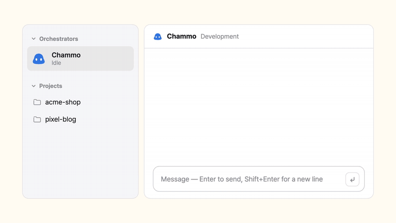

# Chammo

**Claude Code, as a team.**
Every project remembers. No mistake twice. — *Built for myself. Free for you.*

[한국어](README.ko.md) · [Watch the 88-second video](https://honorstudio.co.kr/chammo/en)




Chammo (Korean *참모*, "chief of staff", said *CHAM-oh*) is a desktop app for macOS (Windows in preview) for one person running many projects at once. You chat with one Claude Code session — your chief of staff. It starts a background Claude Code session for each project, hands out the work, reads the results, merges what is safe, and comes back to you only for the calls that can't be undone. Every session is a real interactive Claude Code session you can open and type into at any moment.


## What you can do

### Ask once, and the team gets to work

Tell the chief of staff what you want, by typing or by voice. It splits the request across projects, starts a session where none is running, and answers in a line or two when the work comes back. Each assistant is a tab, like in a browser — drag tabs to reorder them. In the sidebar, a session's picture carries its state: the ring is how full its context is, the dot says whether it is working or waiting on a question.


### Decide only what is yours

Anything that moves money (payments, refunds, billing) waits for you before it is even sent. Sessions stop right before they touch production — a migration on the production database, deleting production data, a production deploy, a send to real users — and a card asks you. Pull requests are merged by the chief of staff once CI is green; the ones that change the database, money or security wait for you. Answer from the card in the chat, the bell, or your phone.


### Read and review next to the chat

Documents a session shows you open beside the chat: Markdown as Notion-like pages you can edit (drag blocks, `/` to insert; edits made outside the app are merged, not overwritten), plus HTML design reviews, PDF, images and video. Each assistant and project also has a dashboard of what it is working on.


### Make your own panels — Chammo modes (preview)

A mode is a Claude Code plugin with an interface: a launch checklist, an order board, a button that runs a routine. Chammo draws it as a real panel — in its own window, on the side, in a dashboard slot, as a pop-up, or full screen. Ask the chief of staff for one (**Modes > New Mode…**) and it builds it as a project. Needs Claude Code 2.1.287 or later.


### Let sessions use a browser you can watch

One **Install** button in Settings gives each project its own browser profile that stays logged in. You watch it live inside the app or open it in Chrome, and when a session calls for you (a login, a captcha) you answer it right from the browser window.


### Run things on a schedule

"Post to the blog every morning", "check orders every 2 hours", or once at a date and time. macOS (Task Scheduler on Windows) wakes the routine even when the app is closed; each run is a real Claude Code session that reports back. If a run fails to start it is retried once 15 minutes later, and a run that stalls is reported to the chief of staff.


### Keep an office

Each session is a pixel character at a desk — typing when it edits, reading when it reads, watching a progress bar when it runs commands. A pet grows from your commits, PRs and CI runs (and passes its traits on to the next generation); a red CI streak or a stuck session shows up as a monster to beat. Coins from merges feed a capsule machine of furniture, desk toys, lights, titles and hats. Every playful part can be turned off.


### And also

- **Voice** — replies are spoken (a macOS voice, or Supertonic, a natural on-device voice); the tab that is speaking lights up. Hold the talk key (Globe or right ⌥) to dictate.
- **Phone** (optional, Tailscale) — pair with a QR code and chat, answer decisions and get notifications from a home-screen web app.
- **Several Claude accounts** — keep more than one login; Chammo switches to the next one when the current one nears its limit.
- **Projects with a harness** — new work gets its own project folder with `CLAUDE.md`, `docs/starter.md` and `docs/roadmap.md` that each session reads first and updates when it finishes.
- **Lessons** — sessions end replies with `Lesson:` lines; they ride along with the next instructions to that project.
- **Tools** — turn MCP servers, plugins and skills on per project or everywhere (the wrench), and see what your harness weighs (Harnitor).
- **Korean and English** — the whole app.

## Requirements

- A Mac with Apple silicon (M1 or later), macOS 14 or later — or a Windows 10/11 x64 PC (preview)
- An internet connection and a Claude account (Pro, Max, …)

Everything else — Xcode Command Line Tools, Claude Code, signing in, GitHub CLI (optional) — is checked on first launch and installed with one button.

## Install

**DMG** — download `Chammo_x.y.z_aarch64.dmg` from [Releases](https://github.com/honorstudio/chammo/releases), drag `Chammo` into `Applications`, and open it. Release DMGs are notarized by Apple.

**One line in Terminal** — downloads the latest DMG, puts the app in `/Applications` and opens it.

```sh
curl -fsSL https://raw.githubusercontent.com/honorstudio/chammo/main/scripts/install.sh | bash
```

**Windows (preview)** — run `Chammo_x.y.z_x64-setup.exe` from [Releases](https://github.com/honorstudio/chammo/releases). It installs for your user only and fetches WebView2 if needed. The installer is not code-signed yet, so SmartScreen may warn — click **More info > Run anyway**. The chief of staff's helper scripts need **Python 3** (`winget install Python.Python.3.12`). Shortcuts use Ctrl instead of ⌘ (Ctrl+Shift with letters, plain Ctrl with digits and symbols).

**From source** — needs Rust (stable), Node.js 22+, pnpm and Xcode Command Line Tools.

```sh
git clone https://github.com/honorstudio/chammo.git
cd chammo/app
pnpm install
pnpm tauri build
```

The app lands in `app/src-tauri/target.noindex/release/bundle/macos/Chammo.app`. Your own build isn't notarized: on first launch click **Open Anyway** in **System Settings > Privacy & Security**, or run `xattr -dr com.apple.quarantine /Applications/Chammo.app` once.

## First run

A five-step setup opens: language → check this Mac (installs what is missing) → your assistant's name, the **projects folder** (each folder inside is a project) and the **HQ folder** (where the chief of staff runs) → features to turn on → ready. Chammo does not log in to anything; it uses the `claude` login already on your Mac. Settings live under **Chammo > Settings…** (⌘,).

## Shortcuts

| Keys | What |
|---|---|
| ⌘1 – ⌘9 | Switch chat tabs |
| ⌃⇧PageUp / PageDown | Move the current tab left / right |
| ⌘Enter | Interrupt and send now |
| ⌘T · ⌘W | New session · stop the focused session (the conversation is kept) |
| ⌘K · ⌘B · ⌘J | Project search · sidebar · task panel |
| ⌘F | Find in document |
| ⌘, | Settings |

## How it works

```
 you ──chat / voice──▶  Chief of staff (live Claude Code session in the HQ folder)
                              │  scripts/task send · SendMessage
          ┌───────────────────┼───────────────────┐
          ▼                   ▼                   ▼
     acme-shop           pixel-blog        coffee-landing     ← claude --bg, one per project
          │                   │                   │
          └──── PRs ──▶ review gates (review.json) ──▶ merge, or ask you
```

- **Sessions** are Claude Code's built-in background sessions. Chammo reads their state from `claude agents --json`, shows the chat from each session's transcript, and opens the full terminal with `claude attach <id>`.
- **Delegation** is logged with `scripts/task` to `tasks.jsonl`; the task panel reads it, and `scripts/task ask` puts a question in your decision inbox.
- **Gates** are computed from PR files, titles and bodies (no AI calls) and written to `review.json`, which the chief of staff reads before merging.

More detail: [docs/ARCHITECTURE.md](docs/ARCHITECTURE.md).

## Configuration

Everything lives in the data folder: `$CHAMMO_HOME`, or `~/.chammo` by default. `config.json` is edited by the settings screen, but you can change it by hand:

| Field | Meaning | Default |
|---|---|---|
| `language` | `"ko"` or `"en"` | system language |
| `assistantName` | name of your chief of staff | `Chammo` / `참모` |
| `devRoot` | projects folder | `~/Developer` or `~/Projects` (whichever exists); the setup lets you pick or create one |
| `hqDir` | chief of staff's folder | `<data>/hq` |
| `githubUser` | used for review and CI | from `gh api user` |
| `ttsCommand` | command that speaks a line of text | macOS `say` |
| `features` | `office`, `tama`, `gacha`, `review`, `voice`, `agentView` (watch session browsers in the app), `autoRevive` (bring stopped sessions back on their own), `computerUse` (let sessions control the screen) | on, except `autoRevive` and `computerUse` |

## Privacy

Chammo runs entirely on your computer. It has no server, no account and no telemetry. All model traffic is Claude Code's and all GitHub traffic is `gh`'s, with your own logins. Chammo itself reaches the internet only for:

- **Version check** — the latest Claude Code version from the npm registry and the latest Chammo release from GitHub. Nothing about you is sent.
- **Browser install** (when you press Install) — Node.js, Chrome Beta and the browser tool parts from their official sources, used only after the checksum or Google signature checks out.
- **Account usage** (only if you saved accounts) — each account's 5-hour and weekly usage from api.anthropic.com with that account's own token, the same request as Claude Code's `/usage`.
- **Phone notifications** (only if you paired a phone) — a title and one line, end-to-end encrypted, through your phone's push service.
- **Telegram** (only if you connect your own bot) — your messages to the bot, the chief of staff's replies (keys and passwords masked) and decision cards go through api.telegram.org. Payments, sends, deletions and production steps are only notified there; you answer them in the app.
- **Harnitor fonts** — loaded from Google Fonts when you open Harnitor.
- **Installers you start** — the setup's install buttons and the Supertonic voice's **Download** fetch from their official sources.

## Status and limitations

- **Early.** Chammo started as one person's daily tool and was opened up as is.
- **It relies on undocumented Claude Code internals** — background sessions, `claude agents --json`, `claude attach`, plugin interfaces. It is tested with Claude Code 2.1.280 and later 2.1.x. An update can break it; Chammo warns when your version is outside the tested range.
- **Background sessions run with `--dangerously-skip-permissions`.** They act without asking. Chammo's gates (payments, production changes, gated merges) sit in front of that, but only use it on projects and machines where you're comfortable with that.
- **Windows is a preview.** Not there yet: the talk key, Supertonic, Office file previews and a signed installer.

## Contributing

Issues and pull requests are welcome. See [CONTRIBUTING.md](CONTRIBUTING.md) for setup, tests and the few house rules.

## License

[AGPL-3.0](LICENSE) © 2026 Honor Studio

Third-party: the terminal's Hangul font `app/public/fonts/ChammoHangul.woff2` is a modified (Hangul-only) version of NAVER [D2Coding](https://github.com/naver/d2codingfont), renamed as the SIL Open Font License 1.1 requires — see [`app/public/fonts/OFL.txt`](app/public/fonts/OFL.txt). The optional Supertonic voice is downloaded to your Mac only when you pick it: the `supertonic` package (MIT) and the Supertone model under the [OpenRAIL-M license](https://huggingface.co/Supertone/supertonic-3) with its use restrictions. Libraries (Tauri, React, xterm.js, BlockNote, pdf.js, Playwright MCP, …) keep their own licenses (MIT / Apache-2.0 / MPL-2.0); see each package.

Chammo is an independent project. It is not affiliated with, endorsed by, or sponsored by Anthropic. Claude and Claude Code are trademarks of Anthropic.
