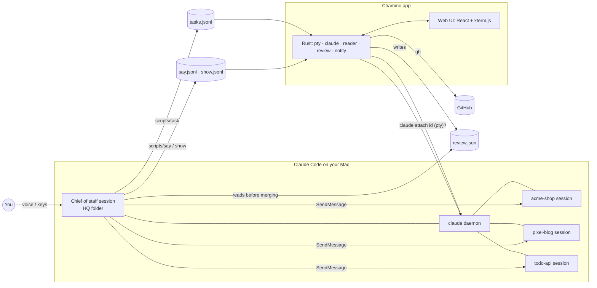

# Architecture

Chammo is a thin desktop shell around Claude Code. It never talks to a model itself: it starts, watches and shows Claude Code sessions, and reads the small files that those sessions and a few helper scripts write.

## Picture



The same thing in one line: **you → chief of staff → background sessions → PRs → gates → merge or ask you.**

## Sessions

| What | How |
|---|---|
| Start a session | `claude --bg --dangerously-skip-permissions -n <name> "<first prompt>"` in the project folder |
| List and state | `claude agents --json` every few seconds |
| Show and type | `claude attach <id>` inside a pseudo-terminal (`portable-pty`), streamed to xterm.js |
| What it is doing | the tail of the session transcript in `~/.claude/projects/` (tool in use, last reply, question) |
| Revive after restart | compare the daemon's start time (`~/.claude/daemon.lock`), then `claude --bg --resume <sessionId>` |
| Adopt a terminal session | end the interactive process, resume the same conversation with `--bg` |

All of these are Claude Code internals without a public contract. They are tested with Claude Code 2.1.28x.

## Code layout

```
app/
├── src/
│   ├── domain/        pure TypeScript + vitest — no DOM, no Tauri
│   ├── ui/            React components (office/, gacha/, tama/, reader/)
│   ├── data/tauri.ts  the only file that calls Rust commands
│   ├── i18n/          tr('한국어', 'English'), assistant()
│   └── main.tsx · reader.tsx · widget.tsx   three windows
├── src-tauri/src/     Rust
└── hq-template/       what a new HQ folder starts from
```

### `app/src/domain` — the decisions

Everything that parses or decides lives here and has tests beside it. A few examples:

- `session`, `status`, `activity` — session list, state (working / needs you / done / idle / asleep), current tool
- `tasks`, `inbox` — delegation cards from `tasks.jsonl`; the decision inbox (only what the chief of staff asks you)
- `review`, `reviewSummary` — PR gates (DB, money, security, 500+ lines) and a 3-line summary taken from the PR text
- `revive`, `stopped`, `adopt` — bringing sessions back after a daemon restart
- `autoAllow` — finds the *Allow* option in a permission prompt by name; skips password / 2FA / payment prompts
- `voice`, `notify` — what to speak and when to notify, with rate limits
- `office`, `dock`, `tama/*`, `gacha` — seats, character states, pet growth, coins and draws
- `replay`, `usage`, `ctx`, `memo`, `reader`, `imeBridge` — day replay, usage limits, context %, notes, reader tabs, Korean IME input into the terminal

### `app/src/ui` — the screens

Sidebar, session grid, task panel, top bar, decision inbox, review page, day replay, notes panel, and the playful views: `office/` (pixel office drawn dot-by-dot on a canvas, skins as color sets), `gacha/`, `tama/` (pet page and the always-on-top widget), `reader/`.

### `app/src-tauri/src` — Rust

| Module | Job |
|---|---|
| `pty.rs` | run a command in a pty, stream output over a Tauri channel, take input and resizes |
| `claude.rs` | find the `claude` binary, start / resume / list sessions, speak through the TTS command |
| `reader.rs` | reader tabs and windows; serves files through the `hodoc://` protocol (home folder only, isolated from the app's own commands) |
| `review.rs` | `gh` calls for open and merged PRs, merge, and revert-PR creation (off the UI thread) |
| `notify_mac.rs` | native notifications (UNUserNotificationCenter); clicking one opens the right place |
| `keys_mac.rs` | app-wide key monitor for Ctrl+Tab in the reader |
| `keyrepeat.rs` | turns off press-and-hold for this app so holding space reaches Claude Code's voice input |
| `drop.rs` | file drag and drop into a session's input |
| `memo.rs`, `tama.rs`, `theme.rs` | small file stores and window helpers |

Rule of thumb: Rust runs things and returns raw output; TypeScript in `domain/` interprets it.

## Data folder

`$CHAMMO_HOME`, or `~/.chammo`.

| File | Written by | Read by |
|---|---|---|
| `config.json` | settings screen | app, scripts |
| `tasks.jsonl` | `scripts/task` (append-only events) | task panel, inbox, replay |
| `review.json` | app | chief of staff, before merging |
| `live.json` | app | session revive |
| `say.jsonl`, `show.jsonl` | `scripts/say`, `scripts/show` | voice, reader |
| `auto-allow.jsonl` | app | task panel, replay |
| `ctx/<session>.json`, `statusline.json` | Claude Code status-line hook | context meter, usage |
| `lessons/<project>.md` | `scripts/task lesson` | attached to the next delegation to that project |
| `tama.json`, `gacha.json` | app | pet, gacha |
| `reader.json`, `voice.json`, `theme` | app | app |
| `notify.log`, `review.log` | app | you, when debugging |

## HQ folder

The chief of staff is an ordinary Claude Code session. What makes it a chief of staff is its folder: a `CLAUDE.md` that explains the job (delegate, log with `scripts/task`, merge only what isn't gated, ask only for what can't be undone), the helper scripts, and a `.claude/settings.json` hook that reminds it when voice mode is on. Chammo creates this folder from `app/hq-template/` on first run; after that it's yours to edit.
